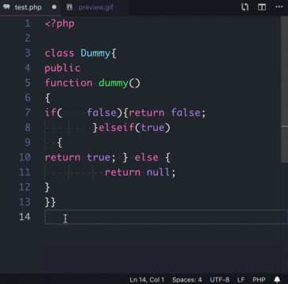

# PHP-CS-Fixer

Integrates PHP-CS-Fixer into Visual Studio Code.

#### Yet another PHP-CS-Fixer extension?

I tested many other extensions but they did not work for me or are outdated, still using the first version of php-cs-fixer. So i decided to make my own that fit my needs. Very minmal, nothing special just what i like.

## Preview

Just by saving your file PHP-CS-Fixer takes care of the code formatting for you.

## Requirement

* php-cs-fixer

For more information please visit: https://cs.symfony.com/

## Configuration

* `php-cs-fixer.executable`: Path to php-cs-fixer executable.
* `php-cs-fixer.configFile`: Path to php-cs-fixer config.
* `php-cs-fixer.pathMode`: Set "--path-mode" parameter.
* `php-cs-fixer.onSave`: Execute command on save.

**NOTE**: You may need to reload to Visual Studio Code when changing any configuration to take effect.

## Error Handling

If an error occurs you can check the Developer Tools Console to get more information.

## License

MIT
